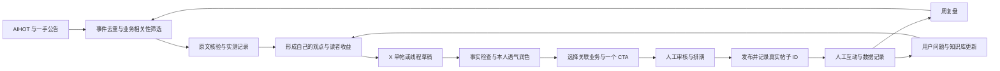
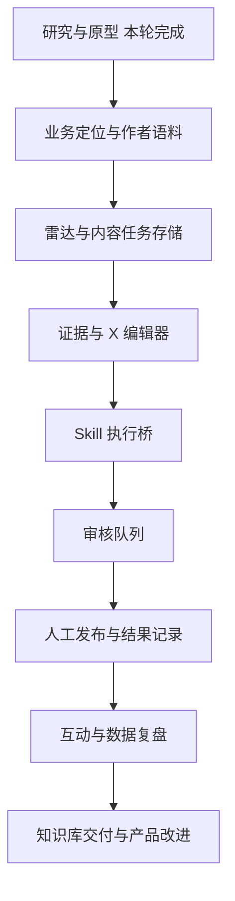

# X 自媒体创作工作台：研究、方法与接入方案

研究日期：2026-10-03。版本：v2。当前以 X 为主要运营平台，情感风险工具已退出本版范围。

## 1. 建议的定位与业务主线

定位建议：**面向中文 AI 实践者、独立开发者和一人创业者，分享经过验证的 AI 工具、MCP 工作流和搭建过程。** 这是根据现有业务提出的定位假设，尚未经过你的账号数据验证。

X 承担发现、表达、交流和建立信任；个人网站承担作者介绍与内容承接；MCP 网站承担工具体验；Codex 相关网站承担对应服务；知识库承担经过整理和维护的实操交付。具体网址、账号、产品价格尚未提供，不在原型里编造。

内容主线建议先保留三条：AI 工具实测、MCP/工作流教程、公开搭建与业务复盘。中文优先，英文只对已经验证的重点内容做本地化，不同时启动两个高频账号。

建议的起步内容配比：50% 实测教程、30% 搭建记录与原创判断、20% 热点解读。此比例是运营实验的起点，持续两周后用实际数据调整。产品 CTA 根据内容相关性选择，不要求每篇都卖东西。

## 2. 生财帖子逐条学习记录

通过已经授权的生财 MCP 搜索“推特”“X 运营”“Twitter”，并调用帖子详情。以下按可取得的正文记录；没有取得附件的帖子，不能视为已经读完附件。文中的增长和收入数字为作者自述，不是收益保证。

| 编号与来源 | 实际读取范围 | 学到的动作 | 融入工作台的方式 | 需要筛掉或核实的内容 |
|---|---|---|---|---|
| S1 [鱼总：371 粉到 63000 粉的复盘](https://scys.com/articleDetail/xq_topic/14425582115155812) | 帖子与合并飞书长文，重点阅读定位、实测 SOP、产品承接与精力分配 | 先解决具体问题；自己操作后让 AI 写；主页承接产品 | 业务定位卡、实测记录、原文证据、产品 CTA | 具体算法倍数、收益政策、封号原因不能照抄为官方规则 |
| S2 [启航：55 天运营与封号复盘](https://scys.com/articleDetail/xq_topic/55521155118255114) | 帖子与合并飞书长文，重点阅读内容类型、资源、回复、避坑 | 教程写清操作路径；评论暴露的问题可成为新选题 | 评论→问题卡→选题；资源推荐保留入口与使用说明 | 不采用“先做泛流量”、互关加热与固定养号数量；封号原因是作者推测 |
| S3 [Snail：推荐向阳乔木的 X 增长 PPT](https://scys.com/articleDetail/xq_topic/82255281514221422) | 推荐正文；PPT 图片和 PDF 未完整读取 | 资源入口、教程、实测能帮助读者少走步骤 | 每个 brief 写明“替谁省哪一步”；交付可执行清单 | 这是分享者的转述，不冒充乔木 PPT 的逐页结论；Snail 身份不等于已确认的蜗牛学长 |
| S4 [石头：读开源算法后的运营干货](https://scys.com/articleDetail/xq_topic/45544815415285248) | 短帖与系列提纲 | 主题稳定、每帖一个主动作、主页转化、复盘 | 内容支柱、主 CTA、主页检查、周复盘 | 短帖不能证明具体算法权重，系列尚未在本研究逐篇展开 |
| S5 [阿西：从 0 到 1 起号与变现](https://scys.com/articleDetail/xq_topic/4845518158244428) | 帖子与合并长文 | 从业务确定定位；线程有结构；素材和模板分别收藏 | 业务上下文、单帖/线程编辑器、素材库与结构库 | 历史 API/分成规则、一天十几条、AI 洗旧稿不能直接用于当前方案 |
| S6 [阿西：低粉变现](https://scys.com/articleDetail/xq_topic/4845181481515888) | 主帖与飞书入口；未取得飞书正文 | 低粉时也可测试明确产品与选题匹配 | 免费样例→知识库目录→产品页的小闭环 | 不把网盘项目的收益与步骤当成已验证，原文交付内容未完整取得 |
| S7 [阿乐：X 引流与创作闭环](https://scys.com/articleDetail/xq_topic/45548581452212148) | 帖子与合并长文 | 真人语料、素材、判断发什么、发布复盘；真实 Demo 承接业务 | 作者语料库、案例证据、内容队列、反馈回流 | 不采用买号、买产品换转发、红包加热；工具价格不沿用旧文数字 |
| S8 [张小吉：海外设计师 Twitter 案例](https://scys.com/articleDetail/xq_topic/588284885214884) | 引荐短帖；外链全文未完整读取 | 可作为 build in public 与长期品牌的后续研究入口 | 记录搭建过程，不只发结果 | 仅列为线索，不声称已经完成外链案例学习 |
| S9 [达轮：n8n 自动化运营 X](https://scys.com/articleDetail/xq_topic/4845111814124148) | 帖子与合并教程 | 待发布队列、成功标记、线程上一帖 ID | 发布状态机、post_id、防重、失败续传 | 旧 Free API 和全权限授权不沿用；“text 非空”不足以证明完整线程成功 |
| S10 [禅禅：X 高级搜索](https://scys.com/articleDetail/xq_topic/5122415555444424) | 只有 44 字引荐，缺少图文细节 | 留作需求发现的研究入口 | 保存人工搜索链接与问题卡 | 无法从这个短帖提炼具体搜索教程，不补编附件内容 |

### 案例之间的矛盾怎么处理

案例有互相冲突的建议：有人主张先做泛流量，有人强调垂直；有人建议互关加热，另一些作者反对。你的业务依赖精准用户和信任，因此本方案选择稳定的 AI 实践主题与真实交流。X 的[真实性规则](https://help.x.com/en/rules-and-policies/authenticity)明确限制交易账号、交换互动、批量重复内容和高频骚扰式回复，不把这些做成工作台功能。

算法源码能帮助理解排序流程，但帖子中的“转发等于多少赞”“发后某个窗口决定一切”不能直接变成硬规则。优先核对 [X 官方开源仓库](https://github.com/xai-org/x-algorithm)，把时间、频次和格式作为账号实验变量。

## 3. 十条可执行方法论

下面是结合案例与你的业务形成的建议，功能和指标是本方案设计，不是原作者已经实现的功能。

| # | 方法 | 具体操作 | 工作台功能 | 检验效果 | 依据 |
|---|---|---|---|---|---|
| 1 | 从业务倒推账号定位 | 明确帮助谁、解决什么、后端交付什么；只保留三条内容支柱 | 定位卡与业务注册表，生成前自动加载 | 来的用户是否匹配实际产品，而非只看涨粉 | S1、S5 |
| 2 | 把主页当作转化入口 | 简介写价值承诺；置顶一篇代表作；主页链接到清楚的业务入口 | 简介/置顶帖草稿、承接页检查清单 | 主页访问、关注、入口点击；缺失数据标记不可计算 | S1、S4、S7 |
| 3 | 热点按相关性筛选 | 对每条热点问：读者有何具体问题？能否实测？关联哪个业务？有没有一手来源？ | 雷达事件卡、来源、时效、业务标签、人工选题理由 | 被选热点中形成原创作品的比例 | S1、S3、S2 |
| 4 | 每条内容增加自己的证据 | 新工具亲自操作；保存截图、版本、失败情况和限制；未实测就写成待验证分析 | 实测卡、证据栏、事实状态 | 发布教程是否可复现；错误与更正次数 | S1、S2 |
| 5 | 把内容做成小型信息产品 | 给场景、步骤、入口、示例、限制；让读者读完能开始做 | brief 的“读者收益”和“可执行交付”必填 | 真实反馈、分享、产品使用；无收藏指标时不伪造 | S3、S2 |
| 6 | 使用自己的语料与判断 | 保存自己的口述、真实经历、原文；AI 整理表达，保留事实和不确定性 | 作者声音库、中文润色、事实前后对照 | 人工修改耗时、是否出现编造经历 | S7、S1 |
| 7 | 让单帖和线程承担不同任务 | 单帖表达一个判断；线程解释一个完整问题；首帖交代价值，后续给证据和步骤 | 单帖/线程切换、首帖备选、逐段编辑与预览 | 同主题比较不同格式；不预设线程必胜 | S5、S1 |
| 8 | 把互动当作需求研究 | 人工回应具体问题；保存高价值评论；引用时给新观点和原作者出处 | 互动收件箱、回复草稿、评论转选题 | 有效对话、重复问题、由回复带来的内容机会 | S2、S4、S7 |
| 9 | 每篇选择一个合适的承接动作 | MCP 教程关联 MCP 网站；搭建记录关联个人站；系统教程关联知识库；纯观点可以无 CTA | 业务侧栏、免费样例、CTA 预览、活动标记 | 网站访问→体验→咨询/购买漏斗，不用曝光代替订单 | S1、S5、S7 |
| 10 | 每周让结果反哺选题和产品 | 比较表现好/差的作品，拆分题材、钩子、形式、CTA；把用户问题送回知识库与产品需求 | 周复盘、内容版本、实验记录、知识库更新队列 | 同类内容中位数、有效线索、交付更新率 | S7、S9、S5 |

不要默认“一天 3–10 条”。起步建议每周 3–5 条有证据的作品，加人工交流，连续两周评估产能与效果，再调整。这是节奏建议，不能保证增长。

## 4. GitHub 创作 Skill 的热度与学习结果

搜索采用 GitHub 仓库搜索、创作者项目入口和相关候选交叉核对；Star 数直接来自 GitHub API 的 2026-10-03 快照。**这是本轮检索到的高热度、相关候选排序，不声称穷尽 GitHub 全站；合集的仓库 Star 也不代表某一个 Skill 的使用量或质量。** 开发工具大合集和仅列链接的榜单不作为创作主模块。

| 相关候选 | 仓库 Star | 本轮重点学习 | 对你的价值与选择 |
|---|---:|---|---|
| [ComposioHQ/awesome-claude-skills](https://github.com/ComposioHQ/awesome-claude-skills) | 76,385 | content-research-writer | 研究→提纲→引用→分段审阅；属于大合集。本轮元数据未标注仓库许可证，先借鉴方法，不整包复制安装 |
| [mvanhorn/last30days-skill](https://github.com/mvanhorn/last30days-skill) | 63,393 | last30days 的功能与依赖说明 | 多社区的近期讨论研究；源码复杂、部分信源需第三方 Key/额度，不能承诺免费完整读 X，暂作为二期候选 |
| [blader/humanizer](https://github.com/blader/humanizer) | 53,632 | README 的编辑流程与声音匹配 | 英文稿去套话、保留事实；英文内容增加后再接，不与中文润色重复运行 |
| [coreyhaines31/marketingskills](https://github.com/coreyhaines31/marketingskills) | 52,498 | social、content-strategy 及 X 参考 | 业务上下文→内容支柱→平台稿件→互动→归因；本轮安装两个对应 Skill |
| [JimLiu/baoyu-skills](https://github.com/JimLiu/baoyu-skills) | 26,281 | post-to-x、infographic 与工具目录 | 资料整理、配图、排版、X 投稿工具分工；原型仍用本地设计，发帖模块保留为可选集成 |
| [KKKKhazix/khazix-skills](https://github.com/KKKKhazix/khazix-skills) | 21,111 | aihot、khazix-writer | AIHOT 是你要的实时线索来源；writer 是作者个人公众号风格，明确不用于 X 短内容，学习实测与质检，不代入他的身份 |
| [op7418/Humanizer-zh](https://github.com/op7418/Humanizer-zh) | 18,848 | SKILL 的约束、流程与中文检查 | 优先保留事实、范围和作者声音；已安装作为中文稿编辑阶段 |
| [dontbesilent2025/dbskill](https://github.com/dontbesilent2025/dbskill) | 10,400 | dbs-hook 的开头诊断 | 先判断内容价值，再处理话题、吸引力、可信度；主要面向口播，借鉴到 X 首句要调整，不整包安装 |
| [remotion-dev/skills](https://github.com/remotion-dev/skills) | 4,817 | 仓库目录与内容范围 | 视频能力候选，当前 X 图文主流程用不到；未做完整技能学习，不列入本轮安装 |

### 从这些 Skill 提炼的自己的流程

1. **上下文先于提示词。** 用一份业务上下文统一受众、产品、作者声音、不能编造的经历与目标动作。
2. **研究与写作分阶段。** 先做事实表和出处，再选观点和结构，最后写单帖/线程；引用位置跟着事实走。
3. **素材与作者声音分开。** 素材库放外部事实，声音库只放自己的样本，禁止把他人的经历移成自己的经历。
4. **事实检查与表达润色分开。** Humanizer-zh 只处理表达，不证明事实正确；润色前后检查数字、否定、范围、来源。
5. **每阶段只调用需要的 Skill。** 雷达用 aihot；内容规划用 content-strategy；X 稿件用 social；最终中文表达用 humanizer-zh。图片生成和发布是后续独立步骤。
6. **开源 Skill 不等于免费运行。** 浏览器、模型、图片服务、第三方数据和 X API 各有条件；UI 应显示运行结果、缺少的条件和费用来源。

### 已安装与未接入

安装位置：本项目 `.agents/skills/`，未批量改全局 Skill。四个目录是 `aihot`、`social`、`content-strategy`、`humanizer-zh`。安装采用固定 Git commit，记录在 `research/skill-pins.json`。

其中 social 已安装完整参考文件，可以使用内容支柱、平台写作和复盘方法。它不是已经接好的 X 发布器。AIHOT 服务接口已实际测试。当前会话的工具目录不会因写入配置自动证明刷新成功；下一轮会读取新 Skill，必要时开新会话让 MCP 工具重新加载。

宝玉的发布 Skill 有 Chrome 和运行时依赖。本轮阅读了其流程，但没有安装或操作你的 X 登录会话。卡兹克 writer 未安装，因为复制作者人格不适合你的品牌。Composio 大合集、last30days、dbskill 与视频模块不自动安装。

## 5. 卡兹克 AIHOT：接入方式与实测

已确认项目：AIHOT，当前官网 [aihot.news](https://aihot.news/agent)，GitHub 镜像来自卡兹克的 [aihot Skill](https://github.com/KKKKhazix/khazix-skills/tree/main/aihot)。本轮只研究官方接入文档与接口，不研究、部署热点站应用源码。

| 场景 | 官方入口 | 返回 | 本轮状态 |
|---|---|---|---|
| 给 Agent 查询说明 | `GET https://aihot.news/api/v1/agent` | Markdown | 200 |
| 今天/一周精选 | `/api/v1/agent/latest`，可加 `window=7d` | Markdown | 默认查询 200 |
| Agent 热点 | `/api/v1/agent/hot` | Markdown | 200 |
| 前端资讯列表 | `/api/v1/items?mode=selected&window=24h&category=ai-products&limit=6` | JSON | 200，已保存研究快照 |
| 前端热点榜 | `/api/v1/hot-topics` | JSON | 200，10 个事件 |
| 最新日报 | `/api/v1/dailies/latest` | JSON | 200 |
| 事件跟踪 | `/api/v1/stories/{publicId}` | JSON | 文档已核对；ID 必须来自服务返回，本轮未逐个调用 |
| MCP | `https://aihot.news/api/mcp` | Streamable HTTP | initialize、tools/list、tools/call 均成功 |

MCP 返回 8 个工具：`aihot_get_latest`、`aihot_search`、`aihot_get_hot_topics`、`aihot_get_story`、`aihot_get_daily`、`aihot_get_weekly`、`aihot_get_monthly`、`aihot_get_codex_resets`。实际调用的是 `aihot_get_hot_topics`，HTTP 200 且没有工具错误。

已经执行 Codex CLI 的 `mcp add aihot --url https://aihot.news/api/mcp`，并用 `mcp get aihot`确认全局配置为 enabled、streamable_http、无需 bearer token。本轮真实 MCP 验证是独立协议请求，尚未在当前会话工具目录里看到新增工具，二者应区分。

前端接入建议：后端拉取 JSON，归一化为事件卡，再经人工选题进入创作。Agent 直接用 MCP/Skill。不要同时开三个轮询器拉同一份数据。文档：[REST API](https://aihot.news/agent?tab=api)、[OpenAPI](https://aihot.news/openapi-v1.json)、[MCP](https://aihot.news/agent?tab=mcp)。

字段按 v1 读取：标题 `title`，来源 `source.name`，原文 `links.original`，AIHOT 页面 `links.aihot`；时间保留 `publishedAt` 与 `discoveredAt`，发布日期为空时不能用发现时间伪装为发布时间。原始归因与链接保留。热点信源数量不能证明消息真实性。

本轮响应的 `links.story` 仍有旧域名。适配器保留原始值；自有导航只对已知 AIHOT 旧主机做新域名映射。不要猜事件 ID，也不要盲目访问数据里任意链接。

### 免费范围与旧接口迁移

匿名、无需 Key；内部研究免费。**面向公众的商业产品、获客、收费服务、转售与持续再分发，应在上线前取得 AIHOT 书面授权。** 官网条款于 2026-09-30 更新，不能把“接口免费”写成“任何商业用途免费”。当前仅做内部研究、连接验证与本地原型，没有对外部署、发布商业内容或转售数据。[官方使用规则](https://aihot.news/terms)

新接入只用 `aihot.news` 与 `/api/v1/*`。旧域名和 `/api/public/*` 的停用日是 2026-10-31。缓存优先遵循响应头、ETag/304；资讯/热点最快一分钟一次；日/周/月报按出刊节奏请求；429 按 Retry-After，5xx 退避并显示上次成功时间。第一版不创建后台自动轮询。

### 热点雷达应补充什么

AIHOT 负责聚合线索，一手来源负责事实核验。自有实验与用户问题负责内容差异。建议后续补充官方模型/工具公告、GitHub Releases、目标作者清单、HN 社区讨论。HN 有[官方只读 API](https://github.com/HackerNews/API)，本轮只核对文档，未连接后台。

第一版不需要全网爬虫。把“标题相似”升级为事件去重：canonical 链接优先，厂商+产品+版本+动作作辅助；避免把同一发布的五篇报道写成五个选题。相关新闻转载也不能当五份独立证据。

## 6. 蜗牛学长：核实结果与未解决项

定位到公开作者名 **“他们都叫我蜗牛学长”**。B 站公开视频元数据确认账号 mid 为 591170964，下列视频属于同一作者：

- [听说你的收藏夹里全是 AI 指南](https://www.bilibili.com/video/BV1vbTP6sEB2/)，2026-06-28。
- [让你的 agent 自己赚米](https://www.bilibili.com/video/BV18Kun6wECe/)，2026-08-06。
- 抖音的 [AI 时代成功率 100% 的方法](https://www.douyin.com/video/7649954668319214898)，标题带 Skill 标签。
- 抖音的 [我不会再开源了](https://www.douyin.com/video/7655162354165927183)，标题含 GitHub、Skill。

本轮检索到另一个作者的 `weid00360-bot/creator-os`，含[“蜗牛学长—赚大米 Skill”拆解卡](https://github.com/weid00360-bot/creator-os/tree/main)。它记录的是别人对视频的分析：输入个人信息、画像、匹配项目、交叉验证。**这个仓库只有 5 Star，也不是已核实的蜗牛学长官方 Skill。** 其中报价与收益叙述不能当作已核实市场数据。

两次浏览器尝试超时，B 站公开元数据的描述为空、没有公开字幕列表；未取得可核验的 Skill 包、本人 GitHub 链接或完整视频文字。因此本轮没有声称看完这些视频，也没有假装安装他的两个创作 Skill。此项仍未完成技能源码学习。

可以提出一个独立的适配设计：**业务画像→真实需求→可交付样例→内容角度→需求反馈**。它是本方案的产品设计，不归为蜗牛学长已验证的方法。原型中的“业务关联”使用这个思路，把题材与自有产品相连；不做自动生成赚钱项目和收益承诺。

## 7. 工作台的实际样貌与页面

新版原型是一张完整应用界面：左侧固定业务导航，主工作区承载研究/写作，右侧承载关联业务和发布检查。页面包括创作室、热点雷达、内容资产、互动收件箱、数据复盘和接入中心。

创作室默认三列：**左边选事件，中间形成观点和编辑 X 稿件，右边检查证据并选择业务承接**。热点不是顶部装饰数字，Skill 也不是一排快捷图标。二者分别出现在工作阶段与运行记录里。

本地原型操作：选择事件、改变业务关联、编辑稿件、校验事实清单、加入本地审核队列、切换导航。热点标题来自本轮 AIHOT 快照，均标记“待回原文核验”；稿件和队列是交互示例；关注数、阅读量和订单不编造。X 未连接、网站转化未接入的页面显示空状态。

### 业务关联的具体映射

| 内容题材 | 免费价值 | 关联业务 | 合适的下一步 |
|---|---|---|---|
| MCP/Agent 实操 | 可复现配置、错误原因、演示 | MCP 网站 | 打开工具详情或体验，入口需实际网址 |
| AI 模型/工具实测 | 输入、输出、限制与场景对照 | 个人网站 | 阅读完整实测、了解作者与其他作品 |
| Codex 工作流/使用场景 | 清楚的教程与实践限制 | Codex 相关网站 | 查看相应服务说明，不在每条热点硬塞推广 |
| 系统知识整理 | 免费目录、单篇样例与更新说明 | 知识库产品 | 看样例→明确适合对象与交付范围→购买 |
| 公开搭建与失败复盘 | 过程、证据与修正 | 个人品牌/个人网站 | 关注或阅读项目记录，可不加销售 CTA |

知识库商品应卖你自己的组织、实测、更新与交付服务。生财付费帖子、AIHOT 摘要和别人的 Skill 不能直接搬进收费包。

## 8. 更新后的 SPEC

### Problem Statement

你的业务和内容来源分散；AI 新闻很多，但缺少从选题、证据、X 写作到业务转化的统一过程。只有工具导航页无法形成稳定运营，纯自动搬运也无法建立个人品牌。

### Proposed Solution

建立个人内部使用的 X 创作台，以内容任务为核心对象，串联热点事件、证据、作者观点、稿件版本、业务 CTA、审核队列和数据反馈。先支持中文单帖和线程，以及知识库文章衍生；长视频与多平台分发留待产能稳定后再扩展。

### Technical Constraints

- Windows、UTF-8 no BOM；文档与源码中文往返检查。
- 起步建议本地优先：页面+SQLite/本地文件；技能由 Agent 按阶段运行。正式技术栈尚未开发，原型不是生产应用。
- AIHOT 使用 v1、保留来源与时效、退避和缓存；商业用途按授权范围处理。
- Skill 不是网站 API。正式平台需要任务执行桥，将输入传给 Agent，记录输出文件、状态和错误；不能在浏览器按钮里“直接执行 SKILL.md”。
- X 第一阶段手动提交审核稿与导入数据。后续官方 API/排期服务需要独立账号授权和预算。
- X 目前官方 API 文档是按用量计费，不能沿用旧生财教程的“Free API 足够”假设。[X API 官方价格](https://docs.x.com/x-api/getting-started/pricing)
- 凭据放后端/受保护配置，不放截图、前端 JSON 或 Markdown。

### Non-goals

情感风险工具；批量搬运和洗稿；自动互赞互关；自动私信和抢评论；一次建多平台矩阵；复制其他博主人格；公开转售聚合数据；默认购买 X 付费接口；本轮不开发订单系统或上线产品。

### Success Criteria

1. 一条事件能追溯到原始来源、选题理由、稿件、业务标签与审核状态。
2. 能完成一篇中文单帖和一篇线程的编辑与检查；未验证事实不会伪装成亲测。
3. 审核稿与已发布记录分离；发布成功记录真实 post_id；不因为点按钮就标记“已发布”。
4. 每周能导入/记录内容结果并产出下一周改进；指标缺数据时显示缺失。
5. 每个产品至少有一个匹配的内容样例和有效入口；知识库有目录、样例、更新责任与交付说明。
6. 第一次试运行两周记录耗时、内容数量与用户问题。增长与收入是观察指标，不写为软件验收承诺。

## 9. 两条流程

### 日常运营



### 搭建顺序与验收

| 阶段 | 做什么 | 本阶段交付 | 可以进入下一步的条件 |
|---|---|---|---|
| 0 本轮已做 | 研究、SPEC、接口验证、技能安装、样貌原型 | 本文、接口报告、4 个 Skill、交互页面 | 范围与能力状态清楚 |
| 1 业务底座 | 真实网址、定位、作者样本、3 条内容支柱、产品目录 | 业务上下文与产品注册表 | 每条业务有受众、承诺、免费样例、真实入口 |
| 2 内容主流程 | 事件卡、证据、brief、中文单帖/线程、保存版本 | 第一个可保存的内容任务 | 一个任务完整走通；来源与草稿不丢失 |
| 3 技能执行桥 | 固定阶段输入/输出，记录 Skill 版本与日志 | 可重复运行的生成/润色任务 | 失败可恢复，重试不覆盖人工修改 |
| 4 发布与互动 | 先人工审核；有明确授权预算后接 X 发布或排期服务 | 发布记录、线程状态、互动问题卡 | 正确 post_id、防重、失败段可续传 |
| 5 复盘与交付 | 手动导入指标与网站转化；知识库更新 | 周报、实验记录、知识库版本 | 能说明哪些作品带来有效访问和真实需求 |



## 10. 日常怎么用

建议的一人工作节奏：上午用 15 分钟看线索，留下最多三个与业务相关的候选；选择一个做原文核验和实测。创作时先填读者问题、观点、证据、限制，再让 Agent 起草。发布前人工读一遍，选一个适合的业务入口。发布后安排一段真正能回复问题的时间。每周集中复盘一次，而不是整天刷新曝光。

初始模板：

```text
读者是谁：
他正在卡在哪一步：
这次分享能帮他完成什么：
事件/来源与时间：
已验证事实：
还没有验证的部分：
我的实际操作与证据：
主要判断：
单帖 / 线程：
关联业务 / 无 CTA：
发布后最希望收到的真实问题：
```

复盘时记录题材、形式、发布时间、曝光、可取得的互动指标、主页/网站访问、咨询、购买、用时。没有平台权限拿到的指标保留为空。帖子归因用 `content_id` 和 UTM，访问/订单数据去重；用户隐私数据不直接放进公开案例。

## 11. 本轮结果与限制

- 生财 MCP 正常，本轮取得 10 个帖子详情，其中 5 篇长文/教程提供较充分的正文，其他为分享转述或引荐，范围见逐条记录。
- 直接核对 GitHub 热度和目标 Skill，完成 4 个项目级 Skill 安装；未运行上游发布脚本。
- AIHOT Markdown、JSON、MCP 真实调用成功；已加入 Codex 全局 MCP 配置。接口验证报告位于 `research/integration-report.json`。
- 蜗牛学长本人创作 Skill 源码尚未找到可核验入口，不冒充已接入。
- 新版原型是操作演示，数据录入、发布和订单都没有连接真实业务。正式平台尚未开始开发。
- 原来的 `自媒体创作工作台方案.md` 是 v1 历史方案，当前开发与研究以本文为准，情感风险工具不进入 v2。
