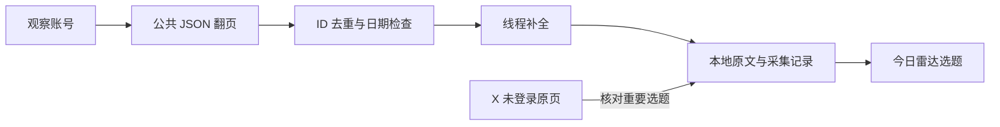

# X 公开内容采集：十二天实测报告

测试日期：2026-10-05，北京时间。当前最适合本项目的主通道是 **FxEmbed 公共 JSON 接口 + 游标翻页 + 线程补全**；重要选题再通过 **X 未登录网页** 核对原文。本次取得了十二天窗口内的 **371 条去重公开帖记录**，包含转帖原文与线程上下文，并非 371 个原创选题。

全程没有登录用户的 X 账号，没有使用或提取用户 Cookie、密码、浏览器会话，也没有调用 X 官方开发者 API、写作模型或图片模型。当前是研究原型，数据已保存，尚未接入网页的生产材料池。

**实际取得的历史内容**

采集窗口为北京时间 **2026-09-23 02:37:48 至 2026-10-05 02:37:48**，长度为连续十二天。补测仍按这个窗口筛选，不把补测期间的新帖混进历史对照。

| 准确账号 | 列表翻页次数 | 该账号发出的帖子 | 其中主帖 | 其中续帖 | 窗口内最早取得的该账号帖子，北京时间 |
| --- | ---: | ---: | ---: | ---: | --- |
| @ChatGPT | 2 | 5 | 4 | 1 | 09-30 01:29 |
| @OpenAI | 3 | 21 | 14 | 7 | 09-24 01:12 |
| @dotey，宝玉 | 9 | 102 | 71 | 31 | 09-23 04:29 |
| @karpathy | 2 | 2 | 2 | 0 | 10-02 08:37 |
| @GitHub_Daily | 4 | 60 | 60 | 0 | 09-23 10:00 |
| @jedeeai，X 榜单作者 | 9 | 138 | 131 | 7 | 09-23 10:17 |

表格记录账号列表接口的结果，共 328 条该账号自身的帖子。加上列表里的转帖原文并跨账号去重，得到 361 条记录。进一步补全线程和评论上下文后，增加 10 条，合计 371 条。

这里的“主帖”指不是回复的帖子，可能含引用其他内容；“续帖”是本次列表返回的回复记录。稀疏账号的窗口内帖子较少，不等于采集失败。翻页已读到窗口之前，但仍不能据此保证所有帖子、评论和 Article 都完整覆盖。

账号身份已经纠正：网站显示名 GitHubDaily 的原帖链接指向 **@GitHub_Daily**。首次误用的 @GitHubDaily 是另一账号，相关历史记录、搜索和稳定性结果已经从以上统计中排除。

**准确性验证**

1. 主帖 ID 对照：宝玉的 71 条主帖、GitHub Daily 的 60 条主帖，在“账号翻页”和“限定日期搜索，排除转帖和回复”中集合相同，重合帖正文哈希也相同。搜索分别翻到第 6 页、第 5 页的空页后停止。两种路径仍共用 FxEmbed 上游，这是范围一致性检查，不是独立数据源保证。
2. 线程缺口：宝玉的一条 12 帖线程，在账号列表中只有 5 条。线程接口补回 7 条。另一个搜索命中的自回复属于给他人的评论；读取其上下文又补入 2 条评论和 1 条父帖。这些评论保留为上下文，不当作新的原创选题。
3. 时间检查：窗口内的原帖 ID 所含时间，与接口返回的发布时间没有发现超过两秒的差异。这能发现部分日期错配，不能核实帖子中的事件是否真实。
4. 原页核验：通过系统现有代理，匿名读取 4 个 X 单帖网页。宝玉 8,321 字符样本与 FxEmbed 正文逐字一致；另一篇长文、ChatGPT 样本、GitHub Daily 样本在排除短链接与展开链接的表示差异后正文一致。已保存匿名网页原始响应，未执行其中的 JavaScript。
5. 第二服务对照：VxTwitter 在一篇样本中只返回 5,886 字符，正文是 FxEmbed 7,763 字符正文的前缀，缺少末尾 1,877 字符；X 原页确认了后面的内容。其他样本还出现链接缺失或未展开。因此它不能默认替换主通道的完整正文。

可直接复核的样本：[8,321 字符长文](https://x.com/dotey/status/2103685982826471785)、[发生截断的长文](https://x.com/dotey/status/2104317565824639146)、[12 帖线程](https://x.com/dotey/status/2104649290668773568)。这里验证的是原文采集一致性，内容事实仍需结合官方公告等一手材料核实。

**各条接入路线的实测表现**

最初脚本走直连，而本机浏览器使用系统代理。随后以同一个现有代理复测，未修改系统代理设置；下表同时考虑了这两轮结果。

| 路线 | 实测结果 | 对本项目的用途 |
| --- | --- | --- |
| FxEmbed 公共 JSON | 六个准确账号均能翻页读过十二天边界；搜索、单帖、线程均可读；通过代理也可读 | 当前主通道 |
| FxEmbed RSS | 可读，但至多 100 条；宝玉缺少列表中 32 条较早记录，@jedeeai 缺少 38 条 | 快速订阅，不能单独承担十二天历史回补 |
| FixupX RSS | 可读，结果与 FxEmbed RSS 一致 | 同一服务的另一个域名，不能算独立备用 |
| X 未登录网页 | 账号页和 4 个单帖页通过代理返回 200，能取得长文正文；账号页样本只给出 1 条置顶和 4 条近期主帖，并结束时间线 | 原文核验与部分近期内容补充；未验证十二天列表翻页 |
| Sotwe 公开网页 | 通过代理能读到 25 条顶层记录，包含置顶、回复、转帖包装及引用内容；匹配样本正文可读 | 可补充近期内容，但上游独立性未知 |
| Sotwe 第二页接口 | 按其公开前端里的路径和游标请求，返回 403，Cloudflare 限制页面 | 十二天回补未跑通，没有尝试绕过验证 |
| VxTwitter 单帖 | 可读，部分长文截断、部分链接缺失 | 辅助核查；未验证账号历史监控 |
| OpenRSS | 直连和代理均返回 503、订阅暂不可用 | 本次不作主源 |
| RSSHub 公共演示地址 | 直连超时，代理复测返回 404 | 本次不作主源；不代表全部自建 RSSHub 都不可用 |
| Nitter 两处公共 RSS | poast 的代理连接发生 TLS 错误；catsarch 返回 503 和关闭说明 | 本次不作主源 |
| TwStalker | 直连超时，代理复测为 403 验证页面 | 本次不作主源 |
| Jina Reader | 直连超时，代理复测为 403 | 本次不作主源 |

FxEmbed 的 RSS 最大条数和域名关系见其 [RSS 文档](https://docs.fxembed.com/guide/advanced/rss-atom-feeds/) 与 [开源仓库](https://github.com/FxEmbed/FxEmbed)。[OpenRSS 自身说明](https://openrss.org/blog/twitter-rss-feeds) 也注明 X 阻止了其生成订阅源。公共服务的地域、缓存、限制和可用状态可能变化，失败结果只代表本次测试。

**“稳定”目前能证明到哪一步**

排除误用的同名账号后，5 个账号进行了 4 轮首页读取，最后一轮与第一轮间隔约 5 分 45 秒至 5 分 48 秒，共 20 次读取全部成功；共同帖子未发现正文变化。正确的 @GitHub_Daily 在补测翻页后再次读取首页也成功。其余正常 JSON、RSS 和线程请求同样已保存响应与时间。

这证明本次会话中可用，不能证明连续十二天在线。**“取得十二天历史”与“连续测试十二天稳定性”是两件事。** 服务缓存也可能使短期重复结果相同，因此不能把本次结果写成长期可用率或服务承诺。目前没有验证出一个在十二天回补与长文完整性上都与主通道等价的独立备用服务。

**X 榜单到底怎么取得内容**

可以确认的三层信息：

- 网站说明，情报从已收录账号的推文中由 AI 筛选；它保留原帖链接、发布时间、上架时间和同一线索的其他提及账号。数据说明还明确会回访推文的曝光，并在覆盖不足时显示无数据。[网站页面](https://xbangdan.com/intel/)
- 匿名取得的约 1 MB HTML 已包含 300 条情报卡片。前端的 `x-track.jedeeai.com` 请求用于登录、收藏、提交、反馈和互动等功能。本次可见前端未展示具体 X 采集入口。因此可确认内容在服务端生成或预先生成，再送到前台；无法只靠页面判断后台用的是爬虫、第三方接口还是二者组合。[原始 HTML](C:/Users/孙宝刚/Documents/ChatGPT/生财有术/research/x-public-network-20261004T184619Z/response-10.txt)
- 作者公开自述有数据组、巡检、动态调整、账号审核等 Agent，并提到服务器迁移曾造成数据延迟。这支持存在后台任务流程。其另一帖提到降低 API 消耗，但没有区分模型 API 与采集 API，也没有披露 X 数据供应商。[后台分工自述](https://x.com/jedeeai/status/2104638183703187529)、[服务器迁移说明](https://x.com/jedeeai/status/2105234568060215441)、[API 消耗自述](https://x.com/jedeeai/status/2089281831292244393)

按这些公开现象推断，其流程很可能是“账号名单 → 定期取得帖子和指标 → 保存历史观测 → AI 提取并合并线索 → 生成情报页”。其中“从 X 取得数据的底层入口”仍未知。**自己写调度和处理脚本，与使用第三方取数接口完全可以同时存在，二者不是互斥选项。**

作者当前 [GitHub README](https://github.com/jedeeai/xbangdan/blob/77040775a67989da1b17bbb0d566b0a855e24092/README.md) 表明仓库只放网站介绍、不存数据；本次 API 核查仓库树只见 README，未取得采集源码。搜索缓存里旧的“每日归档”描述不能作为当前仓库状态。作者帖子检索也没有找到明确供应商名称，搜索未命中本身不能证明不存在。

**我们应该怎样接入**

建议以本次表现最好的公共入口作为第一版主源。我们自行编写和维护账号名单、翻页、线程补全、校验、去重、存储与选题逻辑；上游取数仍依赖公共服务。这是可控制的本地采集流程，不能称为已经完全独立自建 X 取数。

具体规则：

1. 首次回补十二天；以后按原帖 ID 增量读取，保留一定时间重叠，跨页去重。按日期边界停止，同时防止置顶和老转帖导致提前停页；分页上限或重复游标须显示覆盖未完成。
2. 分开保存原作者、转帖账号、主帖、回复关系、原帖链接、发布时间、采集时间和采集通道。普通评论不直接进入新的选题候选；被选中的线程要补齐上下文。
3. 保存全文及外部链接，不默默用更短的备用正文覆盖已取得的长文。重要选题尝试匿名原页核验，无法核验时显示状态。
4. 原文与 AI 摘要分开存放；每个选题必须链接到实际材料。互动数字标明观测时间，不用单次累计浏览量冒充日增长或未来阅读量。
5. 超时、403、429、数据无效与“没有新帖”分别记录。429 时遵循返回的等待信息，不连续重试。上游失败时保留已存历史，并明确最后成功时间。
6. AIHOT、官方博客、GitHub 发布等来源继续补充事件证据。FxEmbed RSS、JSON 和 FixupX 不当作三套独立备份。涉及个人登录会话的方案已从实施范围中排除。

第一版验收应检查：选定账号十二天历史能取得；原帖 ID 和链接可追溯；长文与线程保留；重复同步不重复入库；失败与覆盖不足真实展示。长期稳定性另需跨天观察，此次没有创建常驻任务或定时自动化。

**数据和复核文件**

- [完整去重记录，371 条，包含线程上下文](C:/Users/孙宝刚/Documents/ChatGPT/生财有术/research/x-anonymous-detail-20261004T185228Z/collected-posts-with-thread.json)
- [六账号汇总与日期搜索对照](C:/Users/孙宝刚/Documents/ChatGPT/生财有术/research/x-public-quality-20261004T184339Z/report.json)
- [首轮翻页、RSS、正文与三轮重复测试原始报告](C:/Users/孙宝刚/Documents/ChatGPT/生财有术/research/x-public-history-20261004T183748Z/report.json)，其中错误同名账号已由汇总报告排除。
- [@GitHub_Daily 身份纠正后的历史补测](C:/Users/孙宝刚/Documents/ChatGPT/生财有术/research/x-public-history-20261004T184227Z/report.json)
- [通过系统代理的来源复测](C:/Users/孙宝刚/Documents/ChatGPT/生财有术/research/x-public-network-20261004T184619Z/report.json)
- [匿名 X 原页核验与线程补全](C:/Users/孙宝刚/Documents/ChatGPT/生财有术/research/x-anonymous-detail-20261004T185228Z/report.json)

翻页脚本可在项目根目录用 `node research/x-public-history-check.mjs --handles=dotey,GitHub_Daily --history-only` 重新测试，输出到新的带时间戳目录。其他补测脚本是针对上述已保存批次的审计脚本，部分输入固定为该批次路径。代理测试脚本使用本次已启用的本机代理地址；迁移机器时应先核对代理配置，不能假定相同端口可用。
