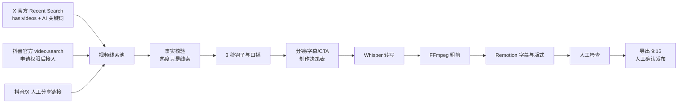

# X Studio 视频雷达与自动剪辑方案

更新时间：2026-10-03

## 先说结论

X 可以用官方 Recent Search 的 `has:videos` 条件捕捉近 24 小时的 AI 视频帖子；工作台按公开互动信号排序，保留原帖链接和封面。抖音官方有“与我相关关键词视频搜索”能力，但要在开放平台申请 `video.search` 权限，结果只返回最近 1 天的公开视频，因此第一版采用“人工粘贴分享链接 + 自动生成制作方案”，接通权限后再切换为自动采集。

## 端到端流程

## 为什么这样分层

工作台不下载或搬运热点原视频，只保存公开线索、原链接和自己的核验记录。自动剪辑层处理用户拥有或获授权的素材：Whisper 负责转写和找高密度片段，FFmpeg 负责裁剪、合并、转码，Remotion 负责品牌版式、动效和字幕，最后保留人工检查。分层后可以替换任一工具，也不会把平台热度误当成事实。

## GitHub 候选

1. [remotion-dev/skills](https://github.com/remotion-dev/skills)：官方 Agent Skills，约 4.8k stars；适合 Remotion 结构、字幕、渲染和多媒体规范。
2. [Sampet/claude-code-skills 的 video-editing](https://github.com/Sampet/claude-code-skills/blob/main/.agents/skills/video-editing/SKILL.md)：面向真实素材，输出转写、编辑决策表和 FFmpeg/Remotion 流程。
3. [ElSalvatore-sys/video-editor-plugin](https://github.com/ElSalvatore-sys/video-editor-plugin)：FFmpeg、Remotion、Whisper 三引擎，覆盖剪切、字幕、转码和程序化片头片尾。
4. [docusphere/claude-skill-motion-graphics](https://github.com/docusphere/claude-skill-motion-graphics)：beat sheet、风格锁定和 Remotion 组装，适合后续系列化栏目。

## 接入顺序

1. 在工作台视频雷达里配置 X 开发者凭据，验证 `has:videos` 查询和 15 分钟缓存。
2. 抖音开放平台申请 `video.search`，只申请自有品牌/产品等业务相关关键词；AI/MCP/Codex 这类通用品类词或其他品牌词不满足该接口申请限制；权限通过后增加服务端 OAuth 和关键词配置。
3. 先把制作方案复制给 Codex 执行，回填脚本和分镜；再接本地 FFmpeg/Whisper/Remotion 渲染任务。
4. 最后再考虑队列、素材存储、失败重试和人工发布确认，不把自动发帖作为第一阶段目标。

## 本次检查结论

已实现视频线索保存、X 视频查询接口和制作指令。当前未配置 X 凭据，抖音全站 AI 热门视频自动采集尚未实现。制作指令不是 AI 执行结果，自动剪辑和 MP4 渲染尚未接入。GitHub 视频 Skill 的安装尝试因本机连接 GitHub 超时未完成。
