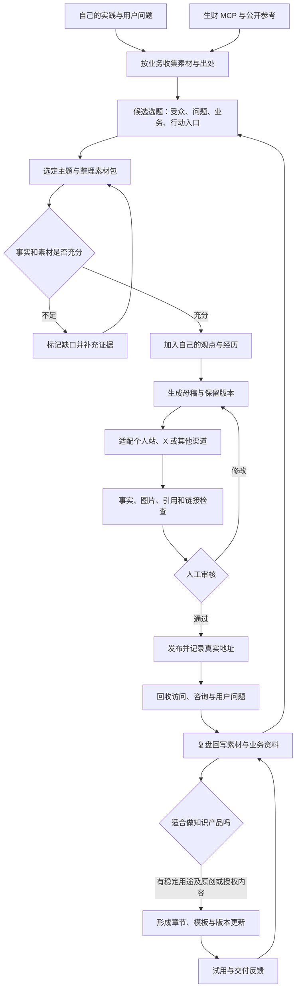
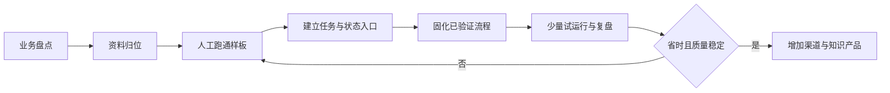

# 自媒体创作工作台：研究与搭建方案

研究日期：2026-10-03（北京时间）。资料来源：生财有术 MCP 的站内搜索与帖子详情，包含工具返回的飞书合并正文。检索关键词为「工作台」「自媒体 工作流」「知识库 售卖」「内容 自动化」，重点阅读以下七篇的搭建与使用章节。帖子里的收入、粉丝和效率数字是作者自述，本方案不将其作为收益承诺，也没有独立复核这些数字。

## 1. 方案定位与已知边界

工作台的目标：把已有业务中的真实实践，变成可持续发布的内容，再把内容产生的用户问题带回产品和知识库。

你已说明的资产：个人网站、MCP 网站、Codex「存质」相关网站、海外情感风险预警网站、计划售卖的知识库、计划经营的 AI 自媒体、已有 X 账号。网站 URL、实际功能、交易链路、受众、语言、经营数据和账号定位尚未提供，也未核验。本轮按业务角色设计，不假设这些系统已经互通。

「Codex 存质」暂记为 **Codex 相关站**，名称与业务待核对。不能据此认定它提供充值、代充或某种官方服务。海外情感站的具体功能也待核对。下文选题、内容卡、产品名称均为设计示例，不表示已有内容、订单或功能。

建议先以「用 AI 做真实项目、把实践转成方法」作为 AI 主内容线的定位假设。个人网站承接长期原创，MCP 与 Codex 相关站承接相应的具体需求，知识库提供系统化方法；情感网站独立受众、资料和表达规则，共用后台流程。X 是分发渠道，不自动等于某个国家、语言或受众。

## 2. 五条值得落实的经验

### 经验一：先规定业务结果，再决定工作台有哪些按钮

竹子的内容系统把受众、高频任务、具体问题和可售产品连在一起；七天假则先拆解自己原有的创作过程，再确定 AI 接哪一段。这两篇共同说明：工作台需要围绕真实内容任务组织。

落地到你这里，每一张内容卡必须填：写给谁、解决什么问题、关联哪个业务、依据是什么、希望读者做什么。每篇只有一个主要行动入口；可以没有售卖动作，但仍应注明目的为教育、建立信任、需求验证或转化。

例如「今天重新授权生财 MCP 的实际过程」可以写给连接失败的人，关联 MCP 网站或个人站教程，前提是先有自己的截图与操作记录；不直接转成 Codex 充值宣传，也不掺入情感网站导流。

来源：[竹子：AI 自媒体的一人公司内容系统](https://scys.com/articleDetail/xq_topic/55521155258121884)、[七天假：Codex × Obsidian 实践](https://scys.com/articleDetail/xq_topic/45548814854181858)。

### 经验二：统一资料来源，按业务隔离事实，写前准备素材包

七天假把个人背景、产品资料、个人素材和外部参考分开保存，并在选题与写稿之间增加素材包；叁斤强调经验与知识库的长期复用。AI 想写得像你，需要你的判断、亲自做过的案例和修稿记录。

落地：建立一套内容仓库；各网站的功能、价格、支持范围仍以各自已确认的产品资料为准，工作台只保留版本与引用，不再复制多份相互冲突的价格说明。外部资料、本人经历、AI 推断分开标注；引用保留原帖、采集日期与适用条件。

先准备十张自己的实践卡：问题、尝试、结果、截图、没解决的部分。每次写稿只读当前业务和选题相关资料。缺证据时在任务上显示「待补素材」，不要让 AI 编造经历或效果。

来源：[七天假](https://scys.com/articleDetail/xq_topic/45548814854181858)、[叁斤：一套 AI 体系的实操复盘](https://scys.com/articleDetail/xq_topic/14588558452125222)。

### 经验三：先跑通一个内容包，再固化为模板和自动任务

X。的工作流从实操灵感到长文，再适配图文平台；南墙把产品分析、单篇拆解、模板聚类、内容生成和审查分开。南墙的经验中特别有用的是：先逐篇拆解，避免把不同素材的标题、正文和图片混在一起；先生成一个完整内容包验证，再扩量。

落地：先选 AI 主线的一篇实操题，完成「个人站长文 + X 适配版」，随后增加一个国内图文渠道。平台规则、语言和展示方式分别处理；复用的是事实、案例和核心观点，不能只是机械缩短原文。

内容包保存母稿、各平台版本、封面/截图、引用、主要链接及检查结果。连续三次走通同类任务后，才把稳定步骤封装为 Skill。先从少量内容开始，依据实际人力与成本调整，不以篇数作为唯一目标。

来源：[X。：普通人用 Claude Code 做自媒体](https://scys.com/articleDetail/xq_topic/82255511515855212)、[南墙：小红书 AI 工作台](https://scys.com/articleDetail/xq_topic/55522822524518814)。

### 经验四：任务要能看懂、能暂停、能续做，失败处理先写清

简哥的反思最值得借鉴：Skill 越多不必然更高效，系统需要明确执行顺序、验证、退出条件和人的决策位置。他列出的验收点包括原稿不覆盖、中断可恢复、失败可追溯、控制权能交回。

落地：每个任务只有一个当前阶段，标明当前版本、下一步、阻塞原因、最近产物和负责人。写稿、检查、发布分别记录状态。第一版默认 AI 做研究与草稿，你决定最终稿和发布。

建议初始规则：同一步连续失败两次停止并保留已有产物；MCP 限流按服务返回的等待时间处理，认证失败进入「需重新授权」，不要盲目重试；任务恢复从最近已完成阶段继续。用「任务 ID + 平台 + 内容版本」记录发布，重试前核对发布回执，避免重复发。

程序检查格式、文件与链接等确定项；AI 检查语义与引用；你检查内容价值、实际效果和受众是否合适。机器检查通过不等于可以公开发布。

来源：[简哥：Harness 工作台与创作者效率](https://scys.com/articleDetail/xq_topic/45548541112554518)、[南墙](https://scys.com/articleDetail/xq_topic/55522822524518814)。

### 经验五：复盘要回到业务，知识库产品要可用且可维护

竹子强调内容带来的咨询与问题，叁斤强调资产沉淀，Luke 强调知识产品必须与具体场景有关。这比「收集了多少篇文章」更接近你的目标。

落地：记录文章对应的内容 ID、业务 ID 和产品 ID，使用渠道专属链接或标记追踪访问；能取得的咨询、试用、购买和退款数据再回填。未知写「未采集」，零必须来自真实记录，不能把没有接口当成零转化。

知识库第一版建议聚焦「AI 创作者从素材到发布的操作方法」，先交付一个完整章节：适用人群、任务清单、可复制模板、亲测案例、失败处理、更新记录与使用问答。验证用户能否完成任务，再扩库。生财帖子用于研究与出处引用，不默认具有全文转载、重新包装售卖的权利；对外产品优先使用自己的原创案例和明确获授权的素材。

来源：[竹子](https://scys.com/articleDetail/xq_topic/55521155258121884)、[叁斤](https://scys.com/articleDetail/xq_topic/14588558452125222)、[Luke：个人工作台、Skill 与虚拟产品](https://scys.com/articleDetail/xq_topic/22258881212414511)。

## 3. 你的业务如何关联

| 业务或渠道 | 工作台中的角色 | 适合产出的内容（建议） | 主要承接 | 首先补齐 |
|---|---|---|---|---|
| 个人网站 | 原创内容与个人品牌的长期载体 | 项目复盘、长教程、方法索引 | 相关产品页、知识库试读 | 网站栏目、作者介绍、可用入口 |
| MCP 网站 | AI 内容主线中的工具专题 | 接入教程、真实任务演示、常见故障 | 本站已存在的对应页面 | 实际支持服务与版本，不虚构接口 |
| Codex 相关站 | AI 主线中的独立业务 | 已核实的使用经验或业务说明 | 经核实的对应业务入口 | 正确名称、业务类型、交付边界 |
| 海外情感风险预警网站 | 独立内容线与独立漏斗 | 产品范围内的匿名情境、使用示例、局限说明 | 对应产品页或教育资源 | 功能依据、目标地区和语言 |
| 知识库售卖 | 内容积累后的产品化交付 | 章节试读、模板演示、真实使用案例 | 购买、交付、更新与反馈 | 原创/授权范围、首章、版本说明 |
| AI 自媒体 | AI 主线的传播和信任建立 | 自己做项目的步骤、比较和失败复盘 | 与选题直接相关的一项产品 | 主平台、内容形式和样稿 |
| X 账号 | 分发、对话与需求获取 | 简短观点、演示、线程、开发日志 | 个人站文章或专题落地页 | 实际受众、语言、发布规范 |

AI 主线可形成：亲自实践 → 教程与复盘 → 个人站 → X/图文分发 → MCP/Codex 相关页面或知识库。

情感线可形成：独立用户问题 → 对应语言内容 → 情感站 → 使用反馈。技术搭建经验可以成为 AI 主线案例，但不能将情感用户私人资料转成 AI 账号素材。

两条线共用任务系统、素材管理和复盘结构；选题、样稿、产品事实、账号和数据分别标记。没有证据支持受众交叉，就不强行互相导流。

## 4. 建议的第一版 SPEC

### Problem Statement（问题陈述）

多项业务同时推进，真实经验、参考资料、选题、平台版本与复盘容易分散；创作可能无法稳定承接具体业务，知识沉淀也难以转成持续维护的产品。这是依据资产组合提出的待验证问题，不是对你当前效率的断言。

### Proposed Solution（方案描述）

设计一个个人创作工作台，提供「今日任务、素材证据、内容生产、业务关联、知识产品、发布复盘」六个入口。以任务卡连接素材、母稿、平台版本、产品入口与结果。AI 提供研究、整理、草稿、适配和检查，你负责观点、核实与发布判断。

### Technical Constraints（技术约束）

- Windows；文本统一 UTF-8，优先无 BOM；中文改完重读。媒体以原文件为准，保留相对引用与版本。
- 第一阶段建议本地内容目录 + Markdown 模板 + 简单任务表；已有工具能承担就沿用。可用 Obsidian 查看同一目录，但它不是必选依赖，本轮不安装。
- 生财 MCP 已验证可搜索和读详情；其他网站、X、支付和分析服务尚未连接。原型仅显示接入需求，不伪装实时数据。
- 密钥与 OAuth 凭证由客户端或独立凭证存储管理，不进入知识库、导出文件和原型。
- 所有业务事实有来源和核验日期；检索按任务取所需资料，避免每次读全库。
- 第一版手动发布、手动登记结果。公开服务上线、发布接口和支付集成属于后续实现阶段。

### Non-goals（明确不做）

本轮不开发上线完整生产系统、不迁移现有网站、不自动发帖或私信、不购买服务、不安装额外插件，不把外部付费文章直接做成售卖产品；不在第一版追求全平台自动发布、复杂 Agent 编队和自动定价。

### Success Criteria（成功标准）

以下为建议的试运行验收标准，非已经达成：

1. 用一个真实主题完成研究、素材包、母稿、至少一个渠道发布包、人工审核、结果登记和复盘入库。
2. 三次同类任务均能查明来源、当前版本、状态和下一步；中断后能续做，原稿不被覆盖。
3. 每篇都有受众、业务关联、出处与一个主要行动入口；涉及产品事实时能定位到经核实资料。
4. 记录三次任务的人工耗时、返工原因和成本，与原流程比较；只有确实省力的环节才自动化。
5. 至少一个知识库章节由试用者实际完成任务，并记录困难；成交数字不作为搭建完成的必要条件。

## 5. 页面与数据设计

### 六个入口

1. **今日任务**：今天值得处理的内容、阻塞原因和下一步。首页以任务为主，不放没有数据来源的收入看板。
2. **素材证据**：自己的操作记录、匿名用户问题、外部引用；支持按业务与选题关联。
3. **内容生产**：候选 → 素材包 → 母稿 → 平台版本 → 待审 → 待发布 → 已发布 → 已复盘。
4. **业务关联**：各网站的受众、产品说明、有效入口和需要补齐的事实。
5. **知识产品**：章节目录、模板、原创/授权状态、版本、更新与交付清单。
6. **发布复盘**：真实发布记录、渠道表现、入口访问、用户问题与产品反馈。无数据时显示未接入或未登记。

### 五类最小记录

| 记录 | 最少字段 | 关联方式 |
|---|---|---|
| 业务卡 | business_id、名称、受众、问题、现有功能、入口、来源、核验时间 | 内容引用 business_id |
| 素材卡 | source_id、原链接/文件、作者、日期、业务、原始事实、可公开范围 | 内容通过 source_id 引用 |
| 内容卡 | content_id、业务、受众、问题、本人观点、来源、状态、版本、下一步 | 发布和产品引用 content_id |
| 发布记录 | content_id、渠道、版本、发布地址、发布时间、回执、链接标记 | 同一母稿可有多个渠道记录 |
| 产品章节 | product_id、章节、版本、来源、交付物、权限、测试、更新说明 | 从原创内容提炼，保留关联 |

## 6. 内容生产流程图



## 7. 搭建过程与每步交付

建议按以下七阶段推进，速度由可用时间和资料完整度决定。顺序是建议，日期不强制。

| 阶段 | 做什么 | 可检查的产物 | 完成才进入下一步 |
|---|---|---|---|
| 1. 业务盘点 | 给每项业务写明受众、用途、入口、边界 | 业务卡与 AI/情感两条内容线 | 不明确的业务仍标待核对，不用于正式宣传 |
| 2. 资料归位 | 整理原创案例、产品事实、外部参考、样稿 | 一套目录和十张实践/问题卡 | 同一事实能找到唯一依据 |
| 3. 人工样板 | 做一篇真实教程，亲自检查全流程 | 素材包、母稿、渠道版、审核记录 | 知道哪步最费时以及什么算好稿 |
| 4. 工作台入口 | 将内容卡与阶段、下一步和产物关联 | 可操作的任务表或本地界面 | 无须翻聊天就知道任务进度 |
| 5. 流程固化 | 只封装反复成功的步骤，定义失败出口 | 研究、素材包、改写、检查等流程说明 | 三次任务可复现，中断可续做 |
| 6. 发布复盘 | 登记发布与渠道结果，追踪主要入口 | 发布记录和每周复盘 | 未采集与真实零值分开 |
| 7. 产品化 | 把原创方法组织成一个知识库章节 | 试读、模板、版本、交付说明与反馈 | 用户能做成任务，再扩展内容和渠道 |



建议内容目录：

```text
创作仓库/
  00_定位与个人事实/
  01_业务与产品/
  02_原始素材/
    本人实践/
    外部参考/
    匿名用户问题/
  03_选题与任务/
  04_创作过程/内容ID/
    素材包、个人观点、母稿、平台版本、审核记录
  05_发布与复盘/
  06_知识产品/
  07_流程与模板/
  08_归档/
```

不需要立即建更多目录；文件通过业务 ID 关联，情感资料单独目录与访问规则，不在公开知识产品导出中默认包含。

## 8. 日常怎么使用

- **每天开始**：看待处理任务和阻塞；从与主业务有关的候选中选少量，先核对材料再写。
- **创作时**：先看素材包，用文字或语音补自己的判断；AI 整理成稿，再做渠道适配；审核图片与正文一起看。
- **发布后**：登记地址和所用版本，有数据再填写，没有就标未登记；将有代表性的用户问题匿名入库。
- **每周**：比较同类内容的表现、有效咨询、入口访问、耗时和成本；决定下周继续哪些题，暂停哪些无关流程。
- **每月**：整理一个已经反复验证的方法，补成知识库章节；检查过期产品事实、死链、授权失效与流程重复。

原型中的内容是示例，点击操作只演示界面流转，不会真的生成、发布、修改业务网站或售卖。

## 9. 三张可直接采用的模板

### 业务卡

```text
业务ID：
名称 / 正确URL：
目标用户 / 地区与语言：
用户具体问题：
现有可交付功能：
功能与价格依据 / 核验日期：
主要转化入口：
明确不能承诺的效果：
可公开案例：
待核对：
```

### 内容任务卡

```text
内容ID / 业务ID：
目标读者与问题：
本次目的 / 主要行动入口：
我的真实观点与亲测经历：
已读来源 / 日期 / 可公开范围：
缺口与待核实事实：
母稿形式 / 目标渠道与语言：
当前阶段 / 当前版本 / 下一步：
完成标准 / 停止条件：
产物位置 / 审核结论：
发布地址 / 结果 / 复盘：
```

### 知识产品章节卡

```text
产品ID / 章节 / 版本：
解决的具体任务 / 适用人群：
先决条件：
操作步骤 / 原创模板 / 亲测案例：
失败时怎么办：
引用与授权依据：
试用结果与修改记录：
交付文件 / 更新范围 / 支持范围：
发布日期 / 下次复核时间：
```

## 10. 注意事项

1. **避免业务串线**：内容的受众和行动入口匹配；同一任务不混用不同网站的价格、功能和用户素材。
2. **保留事实来源**：AI 生成的结构、示例和推断明确标注；无法核实的销量、收入、风险判断不用来证明自己的产品效果。
3. **区分研究与对外产品**：内部学习材料不默认可以商业再分发；不要将生财或其他人的整篇付费材料导出给买家。
4. **情感线保留独立审核**：案例匿名、避免泄露可识别聊天记录；内容不能把工具推断包装成对具体人的确定结论。具体产品功能和目标地区规则未核验，暂不写效果或专业资质承诺。
5. **不照搬帖子中的平台技巧**：作者当时的经验不是今天的平台保证；实际发布前按当前平台要求检查广告披露、AI 内容标识、外链和素材许可。本轮未独立核验这些平台的最新条款。
6. **控制维护成本**：记录单个内容包的耗时与模型/工具成本；不以消耗 Token 或 Agent 数量证明系统有效。任何新模块都应对应反复发生的具体任务。
7. **发布有回执，产品有版本**：不要把进入队列当成已经发布；失败与重试记录留存，知识库更新明确哪些内容发生变化。

## 11. 七篇参考帖与采用范围

| 作者与帖子 | 本方案采用的内容 |
|---|---|
| [简哥：Harness 工作台](https://scys.com/articleDetail/xq_topic/45548541112554518) | 流程、验证、停止、恢复、人的控制权；不把作者提出的未来企业应用当成已验证结论 |
| [七天假：Codex × Obsidian 实践](https://scys.com/articleDetail/xq_topic/45548814854181858) | 同一资料目录、个人事实与产品分开、素材包、母稿版本与反馈沉淀 |
| [南墙：小红书 AI 工作台](https://scys.com/articleDetail/xq_topic/55522822524518814) | 产品资料确认、逐篇拆解、模板验证、独立审查、按状态续做；未采用其收入作预测 |
| [竹子：AI 自媒体的一人公司内容系统](https://scys.com/articleDetail/xq_topic/55521155258121884) | 受众与商业承接、内容任务卡、知识库结构、最小闭环和咨询复盘 |
| [X。：Claude Code 自媒体工作流](https://scys.com/articleDetail/xq_topic/82255511515855212) | 实操碎片、母稿、平台适配、图文起步、人工审核与发布 |
| [叁斤：一套 AI 体系的复盘](https://scys.com/articleDetail/xq_topic/14588558452125222) | 个人经验沉淀、知识库复用、内容与数字产品关联 |
| [Luke：工作台、Skill 与虚拟产品](https://scys.com/articleDetail/xq_topic/22258881212414511) | 业务功能与工作台联动、需求场景、虚拟产品用途；未复制采集或安装指令 |

本文件是建议方案和实施前 SPEC；尚未连接你的业务系统、创建正式发布任务或实施完整工作台。
